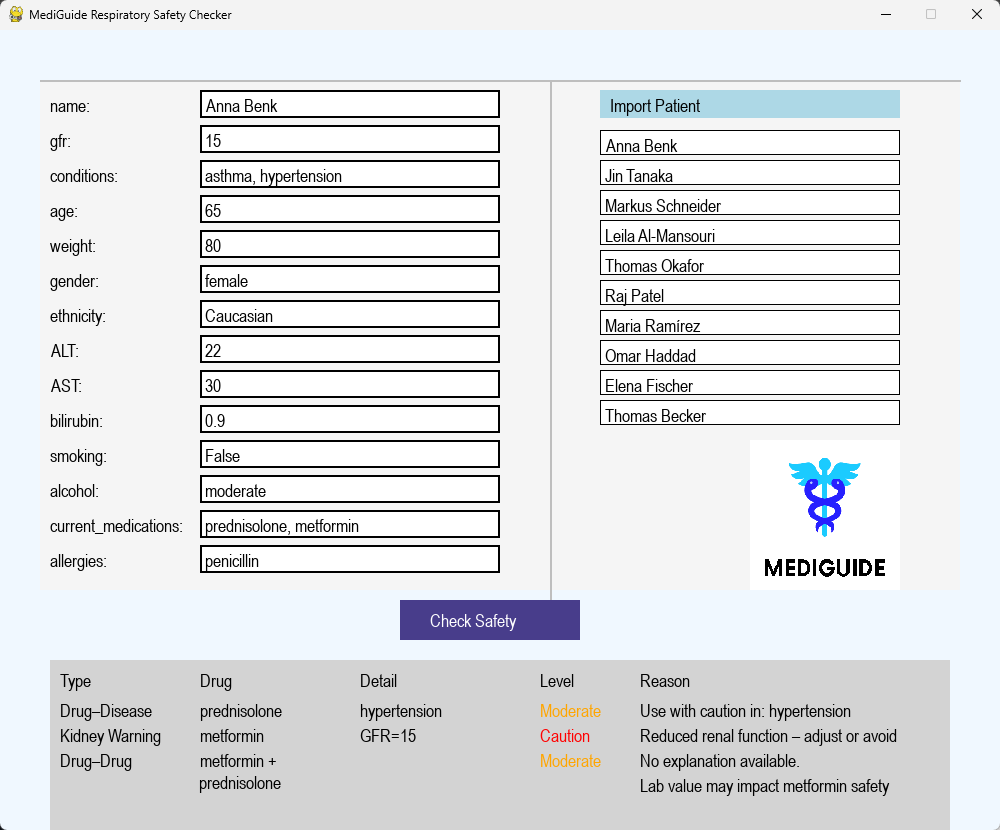

# MediGuide - PoC

**MediGuide** is a prototype decision support tool that aims to help healthcare professionals make safer and more personalized prescribing decisions by integrating patient-specific data with known drug interaction risks.

This repository contains the source code for a Python-based POC with a graphical interface to demonstrate core functionalities.

---

## Purpose

Medication safety is a critical challenge in clinical practice, especially with increasing polypharmacy and patient complexity. MediGuide seeks to:

- Detect **drug-drug interactions** (DDIs)
- Consider patient-specific parameters (e.g., GFR, age, allergies, genetics)
- Provide clinicians with **relevant alerts** and **actionable guidance**
- Explore future integration of pharmacogenomics, lab values, and real-time decision support

---

## Features

- Import patient profiles
- Drug interaction checking (based on CSV data)
- Visual GUI built with **Pygame CE**
- Highlighted warnings for high-risk combinations
- Genetic data placeholder (for future pharmacogenomics expansion)

---
:)

## 

 <!-- replace with actual path to image if available -->

---

## 🏁 Getting Started

### 1. Clone the repo


git clone https://github.com/maramrzik/mediguide-poc.git
cd mediguide-poc

### 2. make sure you have python 3 and pygame CE installed
```bash
